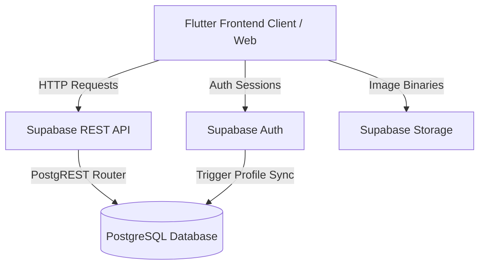

# AuraLuxe Project Architecture & Documentation

Welcome to the documentation for **AuraLuxe**, a premium Single-Vendor E-commerce system built with **Flutter** (Frontend) and **Supabase** (Backend).

This document explains the tech stack, database schema, state management, page navigation flows, and how the backend and frontend interact.

---

## 1. System Overview

AuraLuxe is split into two primary layers:
1. **Frontend (Client App)**: Built with **Flutter** using the **GetX (MVC)** architecture. It compiles to multiple platforms (Web, Mobile, Desktop). It contains customer-facing storefront screens and an administrative control panel.
2. **Backend (Database & BaaS)**: Powered by **Supabase**. It provides PostgreSQL storage, Row Level Security (RLS) access control policies, user Authentication (Auth), and file storage buckets for product images.



---

## 2. Tech Stack

- **Framework**: Flutter (Dart)
- **State Management & DI**: GetX (`GetView`, `GetxController`, `GetxService`)
- **Backend-as-a-Service**: Supabase
- **Networking**: `http` package (making raw RESTful calls against Supabase's Auto-generated PostgREST endpoints)
- **CI/CD & Hosting**: GitHub Actions compiling Flutter Web to the `gh-pages` branch, hosted on **GitHub Pages**.

---

## 3. Database Schema (`supabase_schema.sql`)

The database is built on **PostgreSQL** inside Supabase. It features Row Level Security (RLS) to ensure customer and admin permissions are enforced.

### Tables & Relational Structure
1. **`profiles`**: Linked to Supabase’s internal authentication registry (`auth.users`).
   - Fields: `id` (UUID, primary key), `email` (Text), `role` (Text - can be `super_admin`, `admin`, `staff`, or `customer`).
   - Trigger: A PostgreSQL function `handle_new_user()` automatically inserts a record here whenever a user signs up.
2. **`categories`**: Product categories.
   - Fields: `id` (UUID), `name` (Text), `description` (Text), `is_special` (Boolean), `special_color` (Text/Hex).
3. **`products`**: E-commerce inventory items.
   - Fields: `id` (UUID), `title` (Text), `description` (Text), `price` (Numeric), `discount_price` (Numeric), `category_id` (foreign key to `categories`), `stock` (Integer), `image_urls` (Text array).
4. **`orders`**: Checkout records.
   - Fields: `id` (BigSerial), `user_id` (UUID, nullable to support guest checkouts), `customer_name`, `customer_phone`, `customer_email`, `shipping_address`, `payment_method`, `status` (`pending`, `confirmed`, `processing`, `packed`, `shipped`, `delivered`, `cancelled`), `total_amount`.
5. **`order_items`**: Individual items checked out within an order.
   - Fields: `id` (UUID), `order_id` (foreign key to `orders`), `product_id` (foreign key to `products`), `product_title` (denormalized to lock historical purchases), `quantity`, `unit_price`, `total_price`.
6. **`activity_logs`**: Admin security/activity logs.
   - Fields: `id` (UUID), `performer_id`, `performer_email`, `performer_role`, `action`, `entity_type` (`product`, `order`, etc.), `entity_id`.
7. **`notifications`**: User-specific or general system alerts.

---

## 4. Frontend Architecture

The codebase follows the classic **GetX MVC folder structure**:
`lib/app/`
- **`core/`**: Styling tokens, theme, and colors (`theme.dart`).
- **`data/`**: Communication and parsing models.
  - `models/`: Maps JSON records to classes (`product.dart`, `category.dart`, `order.dart`, `promo_banner.dart`).
  - `providers/`: Services that hit the network. `ApiClient` configures credentials, headers, and handles HTTP errors. `ProductApi`, `CategoryApi`, and `OrderApi` consume the endpoints.
- **`routes/`**: Central navigation definition (`app_pages.dart` & `app_routes.dart`).
- **`modules/`**: Component packages, divided by screen. Each module has:
  - `bindings/`: Instantiates required controllers using GetX dependency injection when opening the page.
  - `controllers/`: Handles state management, UI events, and coordinates API requests.
  - `views/`: Layout and widget rendering tree.

```
lib/app/modules/
├── auth/                 # Authentication (Login/Register)
├── customer/             # Customer Pages
│   ├── home/             # Storefront landing, banners, weekly rankings
│   ├── category_products/# Grid views, custom category banners
│   ├── product_details/  # Image galleries, description, cart addition
│   ├── cart/             # Shopping bag management
│   ├── checkout/         # Guest/User checkout shipping details
│   ├── order_tracking/   # Order status tracking
│   └── order_history/    # Past checkouts listing
└── admin/                # Dashboard control panels (Orders, Products, Logs)
```

---

## 5. Core Application Flows

### 1. Data Retrieval
When any product list loads, the app runs:
```
ProductView -> CategoryProductsController -> ProductApi -> ApiClient -> Supabase Database
```
- The `ApiClient` appends the `apikey` headers and the `Authorization: Bearer <JWT>` header if the user is logged in.
- Restful queries filter using PostgREST format (e.g. `category_id=eq.UUID`).

### 2. User Roles and Security
- Role enforcement starts at the database layer using Row Level Security (RLS) policies. Only users with the role `admin` or `super_admin` in `profiles` can edit categories or products.
- In the frontend, the `ApiClient` provides state getters (`isAdmin`, `isStaff`, `isSuperAdmin`) that control visibility of admin buttons.

### 3. CI/CD Deployment Flow
- Every push to the `main` branch on GitHub triggers the `.github/workflows/deploy.yml` pipeline.
- The workflow compiles the Flutter application to a release web build:
  ```bash
  flutter build web --release --base-href "/aauraluxe/"
  ```
- The pipeline generates a fallback `404.html` (which copies `index.html`) to support dynamic Flutter URL refreshes under GitHub Pages, and deploys the build folder to the `gh-pages` branch.
